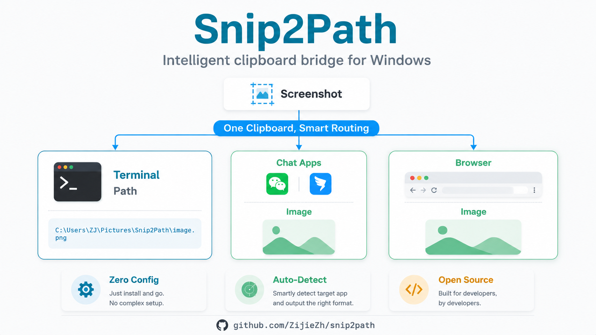

# Snip2Path

<p align="center">
  
</p>

**Screenshot -- Ctrl+V pastes image path in terminal, image in chat apps.**

[中文文档](README.md) | [MIT License](LICENSE)

## The Problem

You take a screenshot. You want to paste it into a terminal-based tool (Claude Code, Cursor, etc.). But terminals do not accept image paste -- you have to save the file, find the path, drag it in, or type it out.

## The Solution

Snip2Path monitors your clipboard. When you screenshot, it:

1. Saves the image to `~/Pictures/Snip2Path/`
2. Writes the **file path** as text + keeps the **original bitmap** on clipboard

Now one `Ctrl+V` gives each app what it needs:

| App | Reads this format | Gets this |
|-----|-------------------|-----------|
| Terminal / CLI | `CF_UNICODETEXT` | `C:\Users\...\Pictures\Snip2Path\snip_143025.png` |
| WeChat / DingTalk | `CF_DIB` | The actual image |

## Quick Start

### Install

```bash
pip install snip2path
```

Or use platform-specific installer:
- **Windows**: double-click `scripts/install.bat`
- **macOS**: run `bash scripts/install-macos.sh`
- **Linux**: run `bash scripts/install-linux.sh`

### Use

```bash
# Daemon mode (recommended) -- runs in background, auto-processes new screenshots
snip2path --watch

# Once mode -- process current clipboard image
snip2path
```

### Workflow

**Windows:**
1. Start `snip2path --watch` (keep the window open)
2. Take a screenshot (`Win+Shift+S`)
3. Switch to your terminal -- Ctrl+V -- file path pasted
4. Switch to WeChat -- Ctrl+V -- image pasted

**macOS:**
1. Start `snip2path --watch` (or `nohup snip2path --watch --silent &`)
2. Take a screenshot (`Cmd+Ctrl+Shift+4`)
3. Switch to your terminal -- Cmd+V -- file path pasted
4. Switch to WeChat -- Cmd+V -- image pasted

**Linux:**
1. Start `snip2path --watch` (or `nohup snip2path --watch --silent &`)
2. Take a screenshot (tool depends on your DE, e.g. `gnome-screenshot` or `flameshot`)
3. Switch to your terminal -- Ctrl+V -- file path pasted
4. Switch to chat apps -- Ctrl+V -- image pasted

## Requirements

- **Windows**: Python 3.8+, Pillow >= 9.0
- **macOS**: Python 3.8+, Pillow >= 9.0, pyobjc-framework-Cocoa >= 10.0
- **Linux**: Python 3.8+, Pillow >= 9.0, xclip (X11) or wl-clipboard (Wayland)

## CLI Options

```
snip2path                 Process current clipboard image once
snip2path --watch         Daemon mode: monitor clipboard continuously
snip2path -o ~/screenshots  Custom output directory
snip2path -p ss_          Custom filename prefix
snip2path -v              Show version
snip2path -h              Show help
```

## Platform Notes

**Linux limitation:** The Linux clipboard (X11 / Wayland) cannot hold both image and text at the same time. Snip2Path restores the image to clipboard by default, so chat apps can paste images. If you need the file path in your terminal, use `snip2path --with-text` (path only) or `snip2path --no-clipboard` (save only, clipboard untouched).

## How It Works

Windows clipboard supports multiple data formats simultaneously. Snip2Path:

1. Detects new images on clipboard (via `GetClipboardSequenceNumber`)
2. Reads the raw bitmap data (`CF_DIB`, `CF_DIBV5`, `CF_BITMAP`)
3. Saves a PNG copy to disk
4. Re-writes clipboard with **both** the original bitmap formats AND a `CF_UNICODETEXT` path string

This way, each application reads the format it prefers. Terminal apps read the text path; image-capable apps read the bitmap.

## Contributing

Issues and PRs welcome.

```bash
git clone https://github.com/ZijieZh/snip2path.git
cd snip2path
pip install -e .
python tests/test_snip2path.py
```

## License

MIT -- see [LICENSE](LICENSE).
